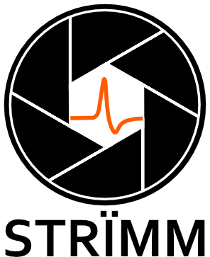

# Welcome to STRÏMM

## What is STRÏMM?

STRÏMM (**S**ynchronised **T**race **R**ecording **I**n **I**mageJ and **M**icro**M**anager, pronounced like "stream") is a software application designed to perform asynchronous and synchronous acquisition of data from multimodal data sources into one program. These data sources can be cameras or any "trace" generating device e.g. an electrode.

Under the hood STRÏMM is a Kotlin application (100% interoperable with Java) with the open source softwares of [ImageJ 2.0](https://imagej.net/) and [MicroManager 2.0](https://micro-manager.org/wiki/Version_2.0) being utilised within STRÏMM. Data flow and acquisition is underpinned by an actor-based framework called [Akka](https://akka.io/). This framework is responsible for handling all incoming data and running experiments. It does this through an actor based concept where actors are assigned roles and given messages to carry out specific tasks. It is lightweight, and has many features built in like thread safety and scalability.

## Status February 2023
STRÏMM has been used in candidate labs to conduct acquisitions to showcase STRÏMM's capabilities. This work will be submitted for publication shortly. Ongoing development is being carried out to maintain and improve the codebase, including logging and fixing bugs and other issues.

## Running STRÏMM

### Requirements
Currently requires the following tools to be installed as a prerequisite to being used:
* [Java](https://www.java.com/download/ie_manual.jsp) (latest version unless otherwise stated)
* [NIDAQ MX](https://www.ni.com/en-gb/support/downloads/drivers/download.ni-daq-mx.html)
* [Microsoft Visual C++ redistibutables](https://learn.microsoft.com/en-us/cpp/windows/latest-supported-vc-redist?view=msvc-170) (Versions 2015 to latest version)

Note that the dependencies on NIDAQ MX and VC++ redistributables are often for specific files. We aim soon to include those within the STRÏMM build so that there is no requirement to install extra software.

### Executable
Coming soon

## Personnel
STRÏMM is a collaborative project between individuals at the University of St Andrews, University of Sheffield, and [Cairn Research Ltd](https://www.cairn-research.co.uk/)
### Developers
[Jacob Francis](https://pulverlab.wp.st-andrews.ac.uk/people/) (Lead Developer, University of St Andrews)  
[Elliot Steele](https://ashleycadby.staff.shef.ac.uk/authors/elliot/) (University of Sheffield)  
Terry Wright

### Additional Contributors
Jeremy Graham  
Ed Finucane
Stefan Pulver  
James Macleod  
Olexandr Konovalov
Ash Cadby
Allen Kelly
