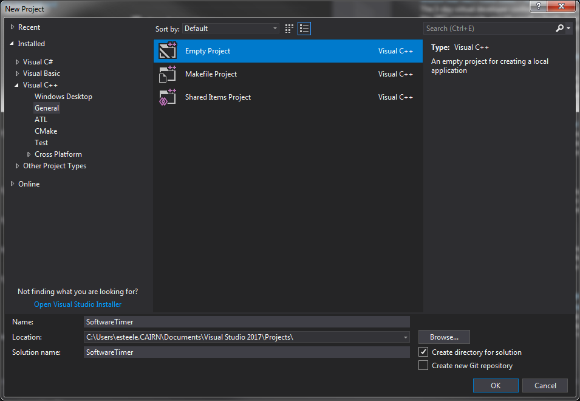
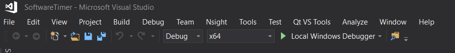
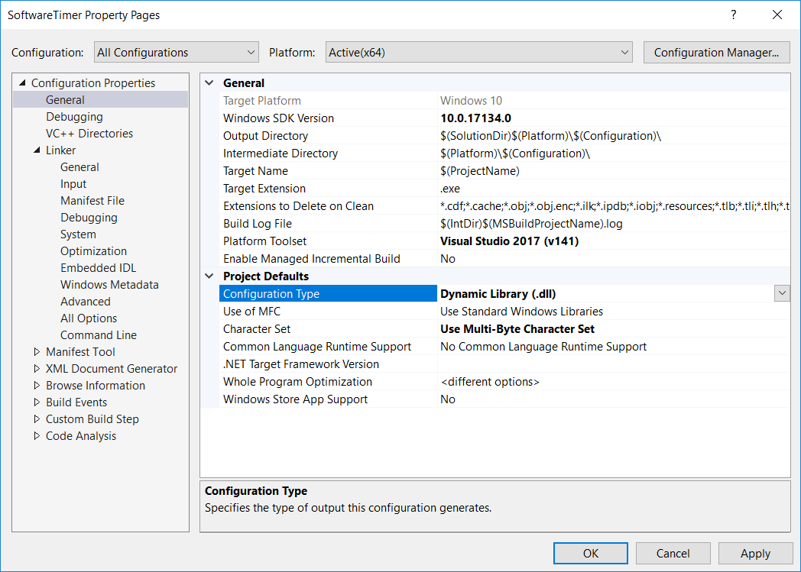
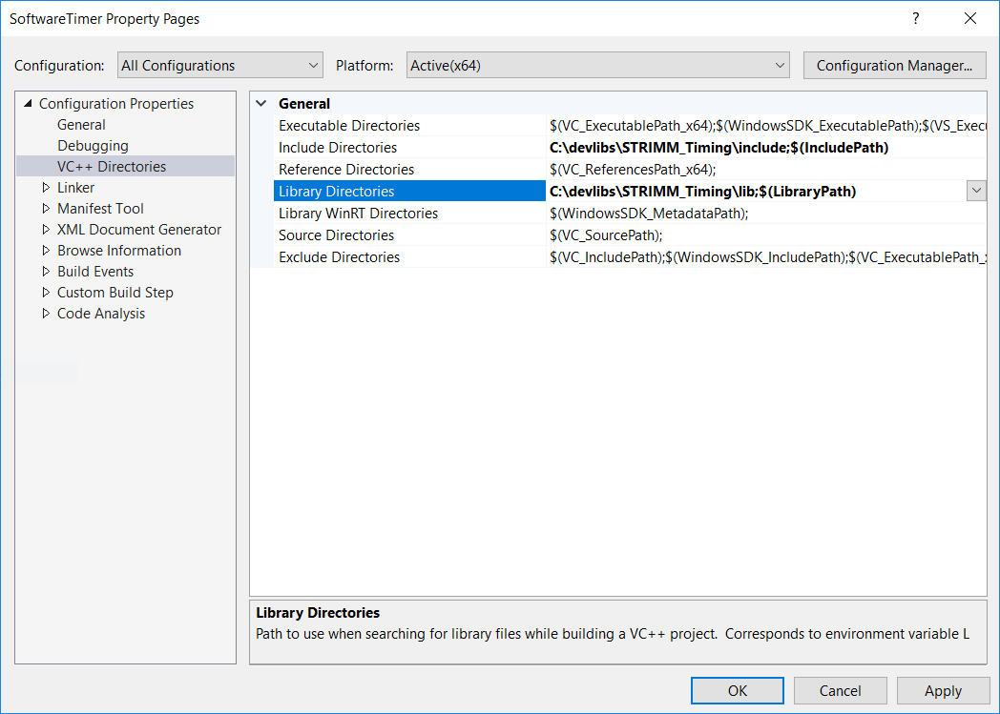
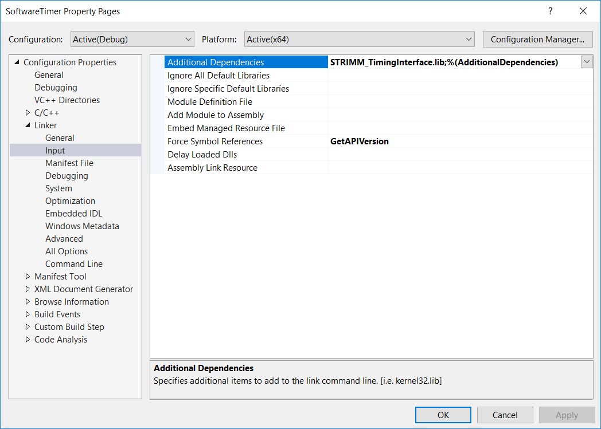
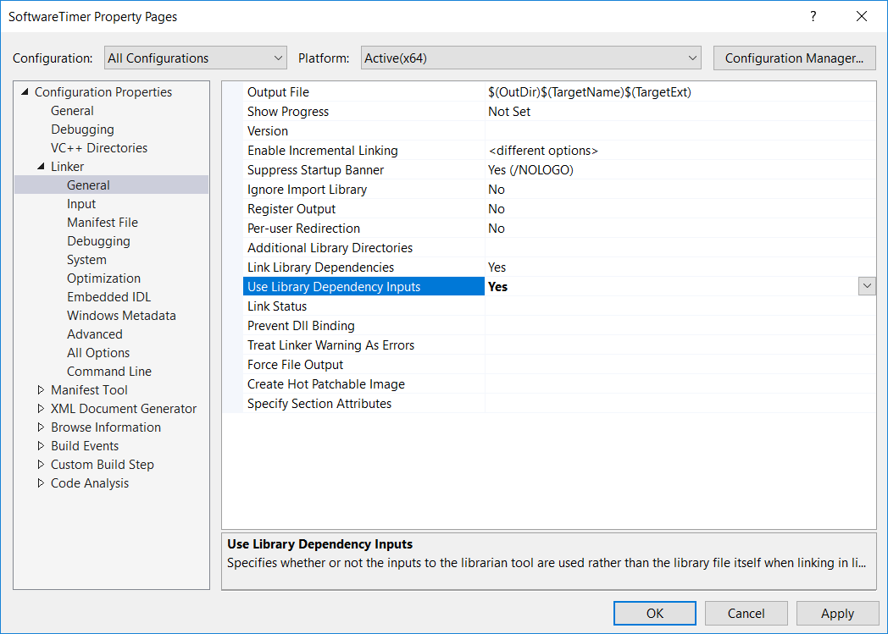

Implementing a New Timer with Visual Studio
-------------------------------------------

This tutorial assumes that you have a copy of Visual Studio 2017 installed on your system, however, due to the C interface exported by the resulting dynamic library, it should be possible to adapt these instructions to work with any standards compliant C++ compiler/tool-chains. Additionally a copy of Git will be required if a full source build is required.

## Setup

### For Single Project Build

1. Download STRIMM Timing interface library and header file to a directory of your choosing (this will be referred to as $(LIB_DIR))
2. Open VS and create new empty project

3. From the tool bar at the top of the window change the build configuration to x64

4. Create a .h file and a .cpp file to hold your timer implementation 
5. Right click on your project and select properties. From this menu :
    * Set General > Configuration Type to "Dynamic Library (.dll)"
    
    * Add "$(LIB_DIR)/include" and any device specific include directories to VC++ Directories > Include Directories 
    * Add "$(LIB_DIR)/lib" and any device specific library directories to to VC++ Directories > Library Directories 
    * Add "GetAPIVersion" to Linker > Input > Force Symbol References (This is a slight hack to force visual studio to export the functions from the STRIMM_TimingInterface library to the dll)
    * Add "STRIMM_TimingInterface" and any device specific libraries to Linker > Input > Additional Dependencies 
    * Add /std:c++17 to C/C++ > Command Line > Additional Options 
    
    * Set Linker > General > Use Library Dependency Inputs to Yes
    

### For Full Source Build

1. Clone STRIMM Timing Interface Source
2. Open STRIMM_TimingInterface.sln
3. Right click on the solution in the solution explorer and create a new project
4. Select empty project
5. Right click on References, select Add Reference and select STRIMM_TimingInterface
6. Create a .h file and a .cpp file to hold your timer implementation 
7. Right click on your project and select properties. From this menu :
    * Set General > Configuration Type to "Dynamic Library (.dll)"
    * Add the relative path to "STRIMM_TimingInterface/" and any device specific include directories to VC++ Directories > Include Directories
    * Add any device specific library directories to VC++ Directories > Library Directories
    * Add any device specific library dependencies to Linker > Input > Aditional Dependencies
    * Add "GetAPIVersion" to Linker > Input > Force Symbol References (This is a slight hack to force visual studio to export the functions from the STRIMM_TimingInterface library to the dll)
    * Add /std:c++17 to C/C++ > Command Line > Additional Options 
    * Set Linker > General > Use Library Dependency Inputs to Yes

## Implementing the timer
1. Include STRIMM_Timing.h (or STRIMM_TimingInterface/STRIMM_Timing.h for a full source build)
2. Add a class declaration to the .h file that extends STRIMM::AbstractTimer
3. Implement `GetTimerName`, `CreateTimer`, `DeleteTimer` in the .cpp file
4. Implement the virtual method from the \ref STRIMM::AbstractTimer "AbstractTimer" class. The \ref STRIMM::AbstractTimer "AbstractTimer" documentation page has an explanation of the requirements of each of the methods

